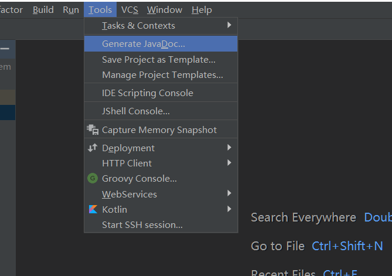
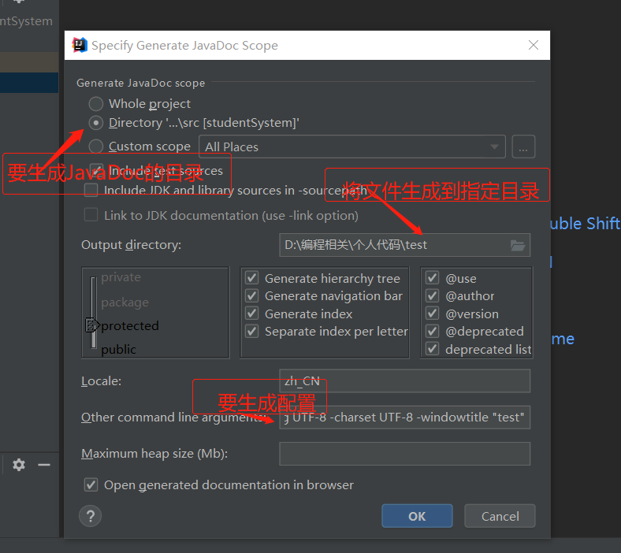
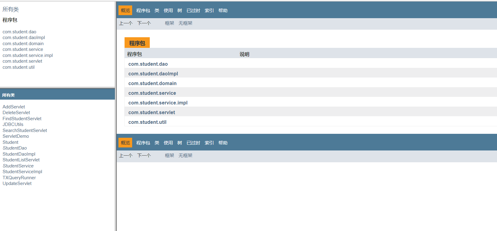

### IDEA生成javadoc文档

利用idea生成javadoc

1. 选中要生成的文件或者文件夹。

2. 在工具栏中找到Tools->GenerateJavaDoc...

   

3. -encoding是java代码编码，-charset是对生成文档所用的编码。-windowtitle就是对应html的<title>标签 

   ```
   -encoding UTF-8 -charset UTF-8 -windowtitle "test"
   ```

   

   

4. 生成打开index.html文件

   


